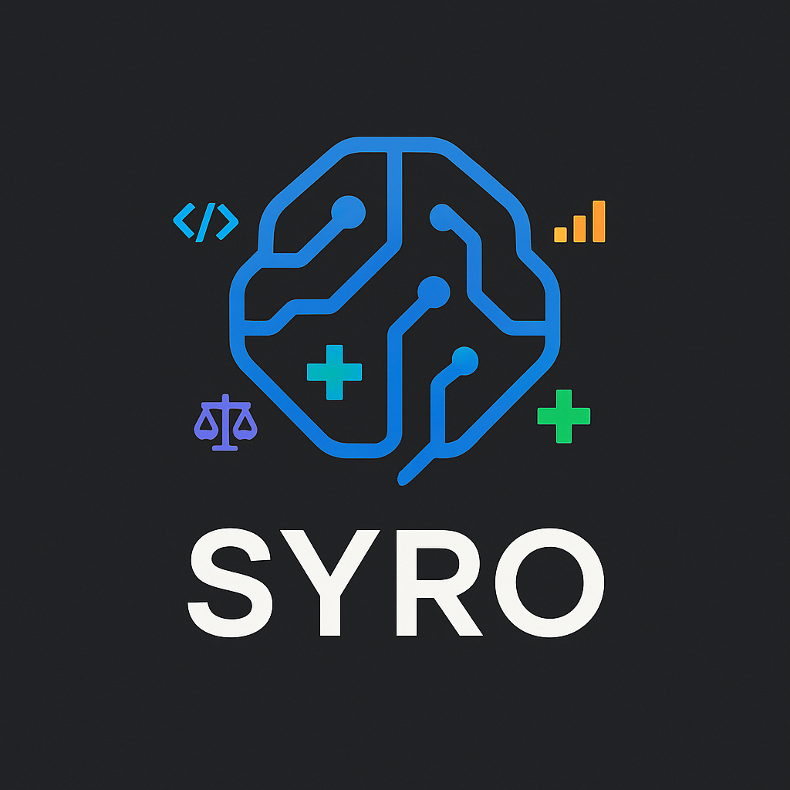
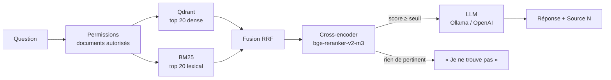

# Syro — RAG hybride multi-domaines

<div align="center">




**Posez des questions à vos documents. Syro répond en citant ses sources — ou dit qu'il ne sait pas.**

[Démarrage](#démarrage-en-3-commandes) • [Démo vidéo](#scénario-de-démo-vidéo) • [Architecture](#comment-ça-marche) • [Évaluation](#évaluation) • [Choix techniques](#choix-techniques)

</div>

---

## En bref

Syro est une plateforme RAG (*Retrieval-Augmented Generation*) complète :

- **Recherche hybride** : vectorielle (Qdrant) + lexicale (BM25), fusionnées par *Reciprocal Rank Fusion*.
- **Reranking** par un cross-encoder multilingue (`bge-reranker-v2-m3`), avec un **seuil d'abstention** : si rien n'est pertinent, Syro répond « je ne trouve pas » au lieu d'halluciner.
- **Réponses citées** : chaque affirmation renvoie à `[Source N]`, avec le fichier et la section d'origine.
- **Multi-domaines** : Tech, MLOps, Médical, Juridique, Finance, Éducation. Les documents sont classés automatiquement ; choisir un domaine filtre la recherche et adapte la persona du LLM.
- **Multi-tenant** : organisations, rôles et niveaux d'accès. Les permissions sont appliquées **avant** la recherche.
- **Ingestion asynchrone** (Celery + Redis), **100 % local et gratuit** avec Ollama, ou OpenAI en une variable.
- **Évaluation** : golden set de 100 questions (4 types d'intention), métriques Recall/nDCG/MRR déterministes et RAGAS.

---

## Démarrage en 3 commandes

Prérequis : [Docker Desktop](https://www.docker.com/products/docker-desktop/) (≈ 8 Go de RAM disponibles).

```bash
git clone https://github.com/Airohh/Syro.git && cd Syro/Syro
docker compose up -d --build                          # toute la stack
docker compose exec syro-api python scripts/load_demo.py   # 19 documents de démo
```

Ouvrez **http://localhost:5173**, puis cliquez sur « Utiliser le compte de démo » (`demo@syro.local` / `syro-demo`).

> ⏱️ Le **premier** démarrage télécharge les modèles : `llama3.2` + `nomic-embed-text` (~2,3 Go) et le reranker (~2,2 Go). Comptez 5 à 15 minutes selon la connexion. Les démarrages suivants prennent quelques secondes.

| Service | URL |
|---|---|
| Interface | http://localhost:5173 |
| API + Swagger | http://localhost:8000/docs |
| État des composants | http://localhost:8000/health/ready |
| Dashboard Qdrant | http://localhost:6333/dashboard |
| MLflow | http://localhost:5000 |

Raccourcis `make` (Linux/macOS/WSL) : `make up`, `make demo`, `make logs`, `make down`, `make test`.
Sous Windows (PowerShell) : `.\start-syro.ps1 -Demo` fait tout et ouvre le navigateur.

**Utiliser OpenAI plutôt qu'Ollama** : `cp .env.example .env`, décommentez le bloc OpenAI (clé, modèles, dimension 1536), puis `docker compose up -d`.

---

## Scénario de démo vidéo

Déroulé d'environ 6 minutes, qui montre chaque brique dans l'ordre où elle intervient. Les questions viennent du golden set : elles fonctionnent avec le corpus de démo.

**1. Le problème (30 s).** Un LLM seul invente quand il ne sait pas et ne connaît pas vos documents. Syro le contraint à répondre **uniquement** à partir de vos sources, en les citant.

**2. Lancement (30 s).** Terminal : `docker compose up -d`, puis `docker compose ps`. Montrer les services : API, worker, Qdrant, Redis, Ollama, MLflow, frontend.

**3. Ingestion (45 s).** `make demo` : les 19 documents passent par l'API, puis sont indexés par le worker Celery (chunking → embeddings → SQLite + Qdrant). Dans l'UI, le panneau **Services** affiche le nombre de chunks indexés et l'état du LLM et du reranker.

**4. Question factuelle (45 s)** — domaine *Général* :
> *Quelle est la différence entre un bi-encoder et un cross-encoder ?*

Déplier les **sources** : fichier › section, pourcentage de pertinence du cross-encoder, et le `[Source 1]` cité dans la réponse.

**5. Terme exact : pourquoi l'hybride (30 s)** :
> *Sur quoi repose le score BM25 ?*

À dire : l'embedding capte le sens, BM25 capte les mots exacts (noms de paramètres, sigles). La fusion RRF combine les deux classements sans avoir à comparer des scores d'échelles différentes.

**6. Question multi-sources (30 s)** :
> *Pourquoi combiner recherche hybride et reranking ?*

Les sources viennent de deux documents différents.

**7. Filtre de domaine (30 s).** Passer sur **MLOps** en haut de l'écran :
> *Comment détecter le data drift ?*

Toutes les sources sont du domaine MLOps. En *Général*, Syro cherche dans tous les documents.

**8. Question hors sujet : l'abstention (30 s)** :
> *Quelle est la capitale de l'Australie ?*

Réponse : « Je ne trouve pas cette information dans vos documents. » Aucun chunk ne dépasse le seuil du reranker, donc le LLM n'est même pas appelé. *(Testez-la avant d'enregistrer : si un chunk passe quand même, montez `RERANK_MIN_SCORE` dans `.env`.)*

**9. Votre propre document (45 s).** Glisser un PDF ou un DOCX dans la zone *Documents*. Le domaine est détecté, l'indexation se fait en arrière-plan, puis on pose une question dessus.

**10. Les coulisses (60 s).**
- `http://localhost:8000/docs` : l'API REST.
- `http://localhost:6333/dashboard` : les vecteurs et leur payload (`organization_id`, `domain`, `filename`…).
- `make test` : 147 tests, dont un parcours complet upload → chat sur un Qdrant en mémoire.
- `make eval-retrieval` : Recall@k, nDCG, MRR sur le golden set.

**11. Conclusion (30 s).** Les choix techniques ci-dessous et leurs compromis.

---

## Comment ça marche



**Ingestion** : upload → file Celery → extraction (PDF/DOCX avec tableaux, TXT, MD, CSV) → classement du domaine → chunks de 400 tokens avec le titre de section → embeddings → SQLite + Qdrant dans **une même transaction**. Si Qdrant échoue, rien n'est gardé et la tâche est retentée.

**Réponse** : historique de la conversation (6 derniers messages) → retrieval ci-dessus → prompt avec les sources numérotées dans des balises `<sources>` → réponse citée. Le mode streaming (SSE) envoie les sources avant le premier token.

Couches optionnelles, désactivées par défaut (activables dans `.env`) : reformulation de requête, HyDE, CRAG, Self-RAG, décomposition multi-hop, cache sémantique.

Détails : [docs/architecture.md](docs/architecture.md).

**Graphe de connaissances du code** (généré par [graphify](https://github.com/safishamsi/graphify)) : [`graphify-out/GRAPH_REPORT.md`](graphify-out/GRAPH_REPORT.md) pour les modules centraux et les 78 communautés, et `graphify-out/graph.html` pour la vue interactive (à ouvrir dans un navigateur, sans serveur).

---

## Choix techniques

| Choix | Pourquoi | Compromis |
|---|---|---|
| **Hybride dense + BM25** | Le dense rate les identifiants exacts ; BM25 rate les paraphrases. | Deux index à maintenir. |
| **Fusion RRF** (k=60) | Fusionne des **rangs**, pas des scores : ni normalisation, ni sensibilité aux outliers. | Ignore l'écart de score entre deux résultats. |
| **Cross-encoder après fusion** | Lit question et passage ensemble : bien plus précis qu'un bi-encoder, appliqué seulement aux 20 meilleurs candidats. | Latence : quelques secondes sur CPU pour 20 passages. |
| **Seuil sur le score du reranker** | La probabilité (sigmoïde) est absolue : on peut dire « rien de pertinent ». | Le seuil (`RERANK_MIN_SCORE`) se calibre sur le golden set. |
| **Une collection Qdrant, filtres de payload** | Multi-tenant et multi-domaine sont de simples filtres indexés ; pas de points orphelins quand un document change de domaine. | Une grosse organisation partage l'index HNSW des autres (filtré). |
| **Préfixes `search_query:` / `search_document:`** | `nomic-embed-text` a été entraîné avec ; sans eux, le retrieval se dégrade. | Changer de modèle d'embedding impose une réindexation (`make reindex`). |
| **Chunks de 400 tokens + titre de section** | Tient dans la fenêtre du reranker (512 tokens) ; le titre porte le contexte. | Découpe par mots, pas par phrases. |
| **Permissions avant la recherche** | Un document interdit ne peut pas remonter, même via le cache. | Liste d'ids passée à Qdrant et à BM25. |
| **SQLite** | Zéro configuration, suffisant en mono-nœud. | Pas de scaling horizontal (voir limites). |

---

## Évaluation

Golden set : **100 questions** en 4 intentions (56 factuelles, 28 identifiants exacts, 8 multi-hop, 8 hors corpus), avec les documents pertinents annotés.

```bash
make test             # 147 tests unitaires et d'intégration, sans service externe
make eval-gate        # intégrité du golden set
make eval-retrieval   # Recall/nDCG/MRR sur la stack réelle → evaluation/report.json
make eval             # + RAGAS (fidélité, pertinence) avec un LLM juge
```

Le composant **BM25 seul** est mesuré à chaque exécution de la CI (test `test_retrieval_corpus.py`) :

| Métrique | BM25 seul |
|---|---|
| Recall@10 | 0,978 |
| nDCG@10 | 0,909 |
| MRR | 0,888 |

Les chiffres de la stack complète (dense + BM25 + reranker) se mesurent avec `make eval-retrieval`, une fois les modèles téléchargés. La métrique `oob_refusal_rate` y indique la part de questions hors corpus correctement refusées.

> Le corpus de démo est petit (19 documents) : les scores sont donc élevés. Pour comparer finement deux configurations, il faut ajouter des documents « distracteurs » proches du sujet.

---

## Limites connues

- **SQLite** : parfait en mono-nœud, pas pour du multi-instance (migration Postgres à faire).
- **BM25 en mémoire** par processus, reconstruit quand le contenu change. Au-delà d'environ 100 000 chunks, il faudrait passer aux *sparse vectors* de Qdrant.
- **Reranker sur CPU** : ajoute quelques secondes par question. Un GPU NVIDIA peut être activé pour Ollama (bloc commenté dans `docker-compose.yml`), et `PERFORMANCE_MODE=fast` désactive le reranker.
- **Questions de suivi** (« et pour X ? ») : l'historique est transmis au LLM, mais la recherche utilise la question telle quelle. Activez `ENABLE_QUERY_REWRITING=true` pour la reformuler.
- **Détection de domaine** par mots-clés (FR/EN), pas par un modèle.

---

## Structure du dépôt

```
Syro/
├── app/                  API FastAPI
│   ├── routers/          auth, chat, documents, admin, permissions, profile, mlops
│   └── services/         rag, hybrid_search, bm25_search, vector_store, reranker, llm,
│                         chunker, ingestion, chat, domain_detector, crag, self_rag, …
├── worker/               worker Celery (ingestion)
├── frontend/             React + TypeScript + Vite
├── evaluation/           golden set, corpus de démo, métriques, RAGAS
├── scripts/              init_db, load_demo, reindex
├── tests/                147 tests (pytest)
├── infra/                Dockerfiles, Langfuse (optionnel), Prometheus
└── docker-compose.yml    la stack complète
```

Référence technique (variables, endpoints, développement local) : [Syro/README.md](Syro/README.md).
Historique des changements : [CHANGEMENTS/CHANGEMENTS.md](CHANGEMENTS/CHANGEMENTS.md).

## Licence

[MIT](LICENSE)
