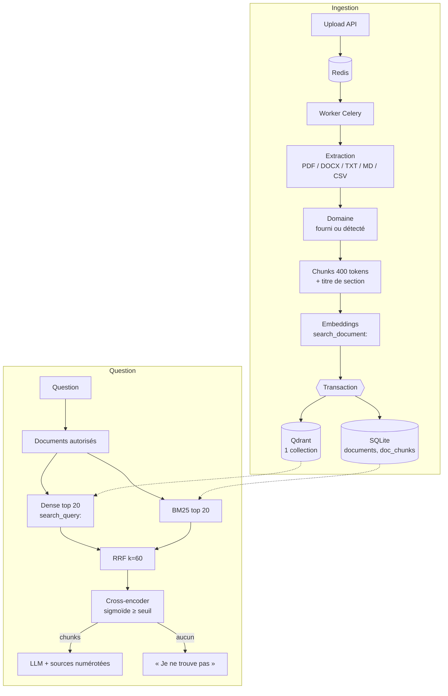

# Architecture Syro — état actuel

> Description de ce que fait **réellement** le code (pas un backlog).
> Historique : [`CHANGEMENTS/CHANGEMENTS.md`](../CHANGEMENTS/CHANGEMENTS.md) · Décisions : `CHANGEMENTS/ADR-*.md`

## Vue d'ensemble

## Modèle de données du retrieval

| Donnée | Où | Rôle |
|---|---|---|
| `documents.domain` | SQLite | **Source unique** du domaine d'un document (fourni à l'upload ou détecté à l'ingestion) |
| `doc_chunks(id, document_id, text)` | SQLite | Texte des chunks, index BM25 ; `id` = id du point Qdrant |
| Point Qdrant `{organization_id, document_id, domain, filename, header, chunk_index, text}` | Collection `syro_chunks` | Recherche dense ; les 3 premiers champs sont indexés |
| `conversations.user_id` | SQLite | Propriétaire : contrôle d'accès à l'historique |

Un domaine n'est **pas** une collection : c'est un filtre (voir ADR-002). `domain` absent ou `general` = aucun filtre.

## Étapes et fichiers

| Étape | Fichier | Détail |
|---|---|---|
| Upload | `routers/documents.py` | Formats supportés uniquement, commit puis file Celery (repli : tâche de fond) |
| Ingestion | `services/ingestion.py`, `services/rag.py` | Embeddings calculés **avant** la transaction ; en cas d'échec Qdrant, rollback SQLite → statut `failed`, retry Celery |
| Chunking | `services/chunker.py` | Sections par titres, fenêtres de tokens avec recouvrement, tableaux Markdown préservés |
| Permissions | `services/retrieval_filters.py` | Ids de documents autorisés, passés à Qdrant **et** à BM25 |
| Dense | `services/vector_store.py` | `query_points` + filtre payload |
| Lexical | `services/bm25_search.py` | Minuscules, sans accents, sans mots vides ; index par organisation, invalidé par empreinte SQL |
| Fusion | `services/hybrid_search.py` | `fuse_rrf` (rangs à partir de 1), 20 candidats |
| Reranking | `services/reranker.py` | Probabilité sigmoïde, tri, seuil `RERANK_MIN_SCORE` ; sans modèle → ordre RRF |
| Génération | `services/llm.py`, `services/chat.py` | Règles RAG communes + persona du domaine, `<sources>` avant la question, historique en vrais tours |

## Couches optionnelles (off par défaut)

| Flag | Effet |
|---|---|
| `ENABLE_QUERY_REWRITING` | 1–2 reformulations LLM = listes supplémentaires dans la RRF (rend autonomes les questions de suivi) |
| `ENABLE_HYDE` | Vecteur d'un passage hypothétique généré par le LLM |
| `ENABLE_CRAG` | Si la pertinence (overlap lexical + score du reranker) est faible → 2e passe élargie avec reformulations |
| `ENABLE_SELF_RAG` | Filtre les chunks peu pertinents avant le prompt |
| `ENABLE_QUERY_DECOMPOSITION` | Questions composées → sous-requêtes parallèles, fusion RRF, rerank sur la question d'origine |
| `ENABLE_SEMANTIC_CACHE` | Cache du retrieval par similarité, clé incluant permissions, filtres, historique et **empreinte du contenu** (pas de résultat périmé après une ingestion faite par le worker) |

## Robustesse

- Embeddings indisponibles → recherche **BM25 seule** ; Qdrant indisponible → idem.
- LLM indisponible → `503` explicite (circuit breaker : échec immédiat pendant 30 s après 5 échecs).
- Aucun chunk pertinent → réponse d'abstention, sans appel au LLM.

## Observabilité

Prometheus (`/metrics`), MLflow (requêtes et ingestions), Langfuse optionnel (`infra/docker-compose.langfuse.yml`), logs JSON avec correlation id, `/health/ready`.

## Évaluation

| Commande | Rôle |
|---|---|
| `make test` | Dont BM25 réel sur le corpus + golden set (`test_retrieval_corpus.py`) et parcours API complet (`test_end_to_end.py`) |
| `make eval-gate` | Intégrité du golden set |
| `make eval-retrieval` | Recall/nDCG/MRR/refus hors corpus sur la stack live |
| `make eval` | + RAGAS |
